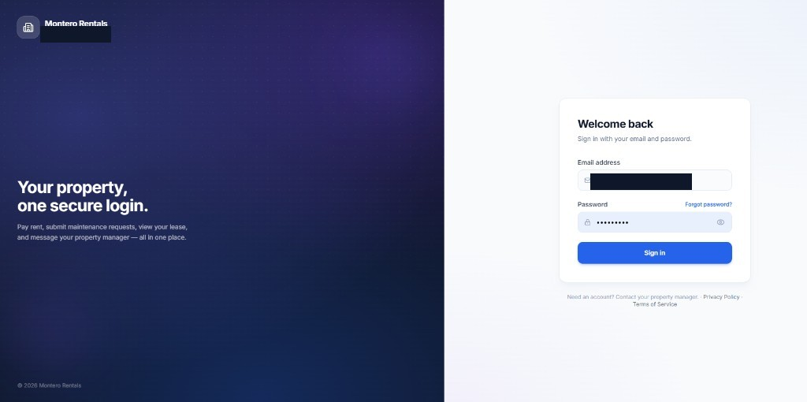
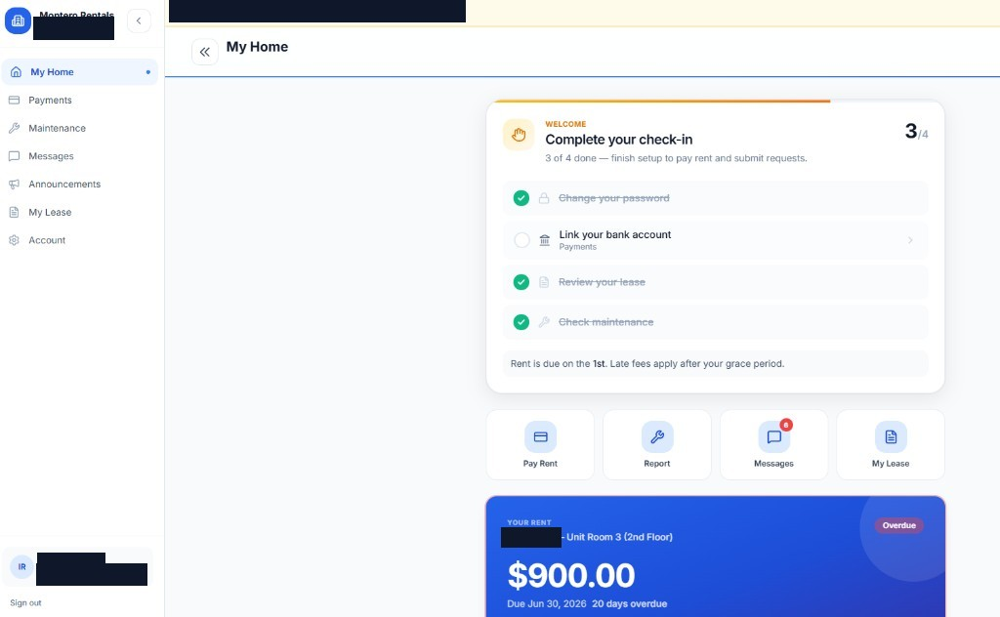
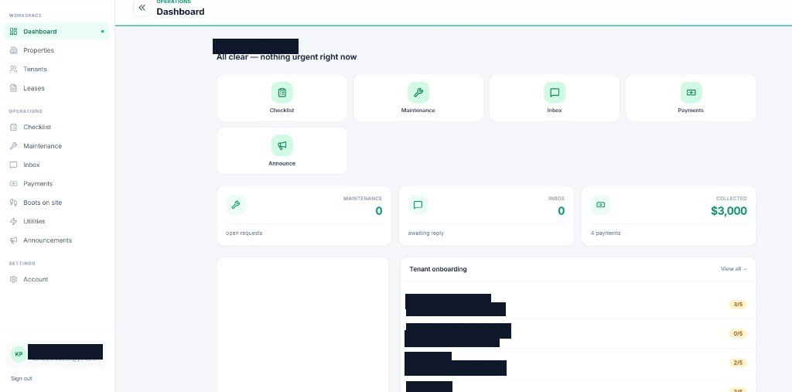
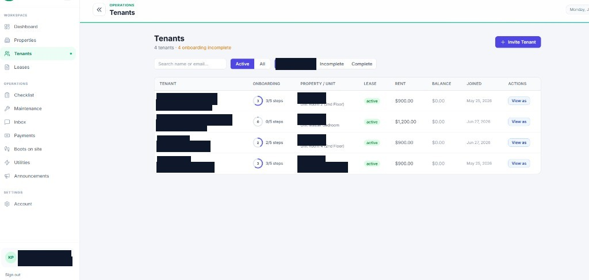
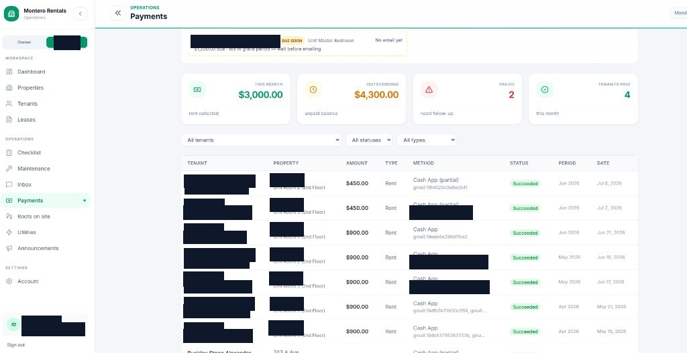
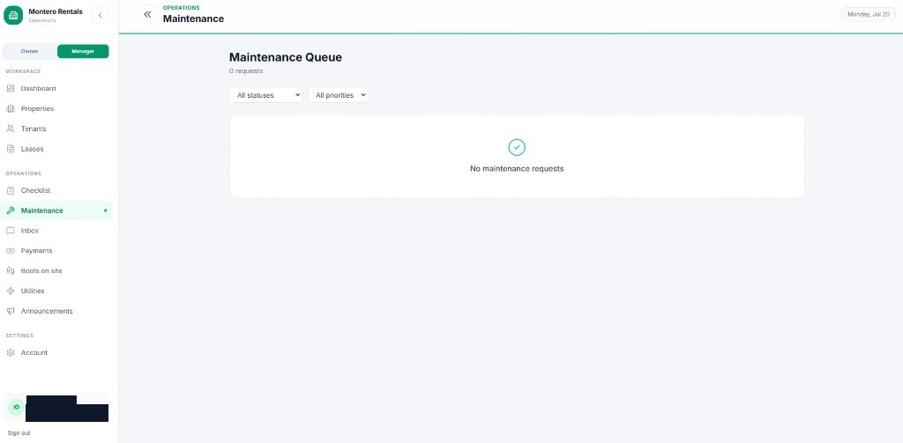
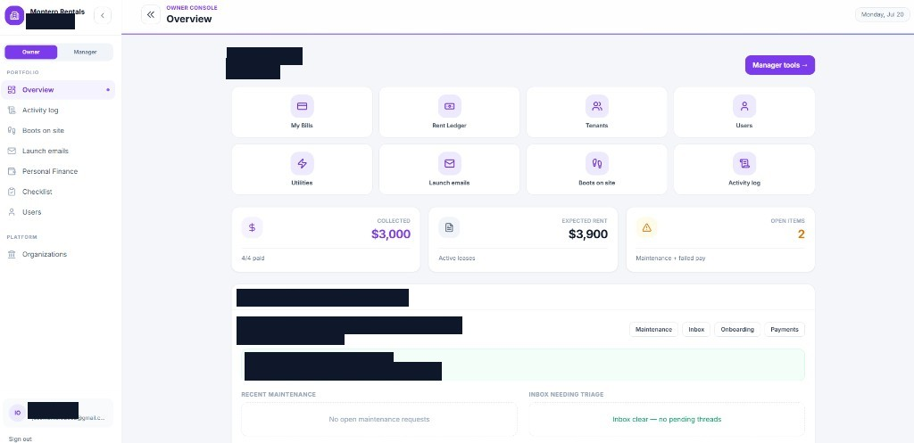

# Montero Rentals — Property Manager

Web app for **Montero Rentals** with three portals in one codebase:

| Who | URL path | What they do |
|-----|----------|--------------|
| **Tenants** | `/tenant` | Pay rent, link a bank, Autopay, deposits, maintenance, messages, lease, account |
| **Property manager** | `/manager` | Tenants, leases, payments, utilities, inbox, maintenance, playbook, site visits |
| **Owners** | `/admin` | Oversight, finance, orgs, "View as" impersonation |

**Author:** Jose I. Montero  
**Live site:** [https://www.monterorentals.com](https://www.monterorentals.com)

Env template: [`.env.example`](.env.example). First-run guide: [`SETUP.md`](SETUP.md).

---

## Screenshots

Real UI captures with **names, emails, and street addresses redacted**.

| Login | Tenant — My Home |
|:-----:|:----------------:|
|  |  |

| Manager — Dashboard | Manager — Tenants |
|:-------------------:|:-----------------:|
|  |  |

| Manager — Payments | Manager — Maintenance |
|:------------------:|:---------------------:|
|  |  |

| Owner — Overview |
|:----------------:|
|  |

- **Login** — one secure entry for all roles; role is revealed after sign-in.
- **Tenant** — check-in checklist, quick actions, rent status / overdue.
- **Manager** — ops dashboard, tenant roster + “View as”, payments (incl. Cash App import), maintenance queue.
- **Owner** — portfolio oversight, collected vs expected rent, manager playbook.

---

## What's in this repo

| Path | What's there |
|------|----------------|
| `src/` | Express API — auth, payments, utilities, leases, site visits, webhooks, email, DB migrations |
| `client/` | React + Vite UI for login + all three portals |
| `docs/` | README screenshots (PII redacted) |
| `scripts/` | Ops helpers (Cash App import, smoke tests, bank reminders, QA) |
| `schema.sql` | Base Postgres schema |
| `src/db/migrations/` | Incremental SQL migrations |

---

## How the pieces fit together

```text
Browser (React)  →  Express API (:8080)  →  Supabase Postgres
                         │
         ┌───────────────┼────────────────┐
         ▼               ▼                ▼
      Plaid           Stripe           Rocket Lawyer
   (link bank)     (ACH + Cash App     (e-sign leases*)
                    + Connect)              │
                         │
              Gmail (org OAuth: utility e-bills + Cash App receipt import)
```

- **Auth:** Custom JWT (Bearer access + HttpOnly refresh cookie on `/auth`).
- **Rent:** Stripe ACH via Plaid processor tokens (not Plaid Transfer). Also Stripe Cash App Pay.
- **Off-app Cash App:** Imported from org Gmail (`cash@square.com`).
- **Leases:** Rocket Lawyer (API may be pending; leases are often created/signed manually).
- **Deploy:** Push to `main` → Railway builds, runs migrations, serves `client/dist` from Express.

---

## Stack

| Layer | Tech |
|-------|------|
| API | Node.js, Express (`src/app.js`) |
| UI | React + Vite (`client/`) |
| Database | Supabase Postgres (session pooler via `DATABASE_URL`) |
| Banks | Plaid Link → Stripe bank accounts |
| Payments | Stripe (ACH, Cash App Pay, Connect) |
| Email | Gmail API (org OAuth); optional Resend |
| Hosting | Railway + Cloudflare |

Secrets go in **`.env.local`** (gitignored). Loaded by `src/config/env.js`.

---

## Run it locally

Needs Node 18+ and a Postgres URL in `.env.local` (start from `.env.example`). See `SETUP.md` for a full walkthrough.

```powershell
npm install
cd client; npm install; cd ..

npm run db:migrate

# Terminal 1 — API (:8080)
npm run dev

# Terminal 2 — UI (:5173, proxies API)
cd client; npm run dev
```

- Health check: `GET http://localhost:8080/health`
- Stripe webhooks (optional): `stripe listen --forward-to http://localhost:8080/webhooks/stripe`
- Smoke test: set `SMOKE_TEST_PASSWORD`, then `npm run smoke:test`

### Handy scripts

| Command | Purpose |
|---------|---------|
| `npm run build` | Build `client/dist` |
| `npm run payments:health` | Stripe / Plaid / tenant bank readiness |
| `npm run tenant:bank:status` | Who still needs a verified bank |
| `npm run import:cashapp -- --gmail` | Dry-run Cash App import from Gmail |
| `npm run db:reset-password` | List / set passwords |
| `npm run qa:bootstrap -- --apply` | Align local QA passwords (requires `SMOKE_TEST_PASSWORD` or `--staff-pw`) |

---

## Production notes

1. Push to `main` → Railway auto-deploys.
2. Migrations run on pre-deploy (`npm run db:migrate`).
3. Keep `CLIENT_ORIGIN=https://www.monterorentals.com` (emails, Plaid, Google OAuth).

### Do not break

- Plaid tokens are encrypted with `ENCRYPTION_KEY` — do not rotate after banks are linked.
- Stripe webhooks need the **raw body** + `STRIPE_WEBHOOK_SECRET`.
- Refresh token is an HttpOnly cookie, not in the login JSON body.
- Never commit `.env.local` or `client/dist`.

## License

MIT — see [LICENSE](LICENSE).
